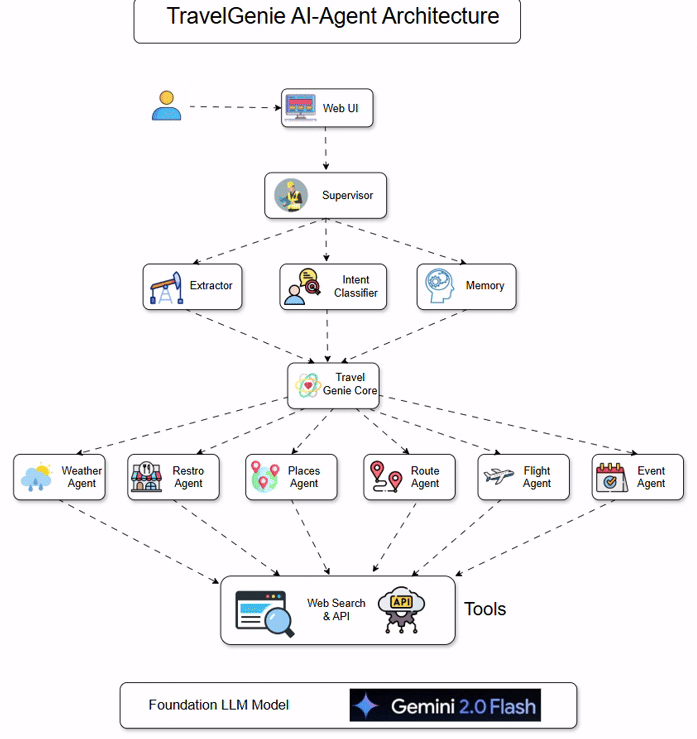

 
      


# TravelGenie (AI-Powered Travel Itinerary Planner)

TravelGenie is a full-stack AI-powered travel assistant that helps users effortlessly plan end-to-end trips through a conversational interface. Built with FastAPI (backend) and TypeScript + Tailwind (frontend), it uses multi-agent orchestration to deliver intelligent travel suggestions.

---

## Project Architecture




## Project Features
- **Chatbot Interface** to collect trip details from the user.
- **Multi-Agent System**: Weather, Route, Flights, Events, Food, Places.
- **Dynamic Itinerary Generator** powered by LLM (Gemini).
- **Real-time APIs**: Google Maps, Amadeus, Ticketmaster, OpenWeather, and more.
- **FastAPI Backend** + Vercel-Deployed React Frontend.
- **Auto-Deploy via GitHub ➔ Render (backend)**.

---

## Folder Structure (Simplified)
```
rohit180497-agentverse-hackathon/
├── app/                    # Main application
│   ├── fastapi_app.py      # Entry point for backend
│   ├── agents/             # Individual agent logic (weather, flights, etc.)
│   ├── core/               # Planning, reasoning, itinerary generation
│   ├── supervisor/         # Memory, extraction, intent
│   ├── llm/                # Gemini integration
│   ├── prompts/            # LLM prompt templates
│   └── frontend/           # TypeScript + Tailwind React UI
│       └── src/components/ # Chatbot UI, Dashboard Cards
├── render.yaml             # Render deployment file
├── requirements.txt        # Python dependencies
└── README.md
```

---

## Getting Started (Local Dev)

### 1. Backend Setup
```bash
cd app
python -m venv venv
source venv/bin/activate  # or venv\Scripts\activate
pip install -r requirements.txt
uvicorn fastapi_app:app --reload
```

### 2. Frontend Setup
```bash
cd app/frontend
npm install
npm run dev
```
Visit `http://localhost:5173`

---

## Environment Variables
Create a `.env` file in `app/` for backend keys:
```
GOOGLE_MAPS_API_KEY=...
OPEN_WEATHER_API_KEY=...
GEMINI_API_KEY=...
TICKETMASTER_API_KEY=...
AMADEUS_API_KEY=...
AMADEUS_SECRET_KEY=...
```

---

## 🌐 Deployment

### Backend (Render)
- Configure Render service with `render.yaml`
- Enable **Auto-Deploy from GitHub**

### Frontend (Vercel)
- Connect `app/frontend` folder as root
- Output directory: `dist`
- Auto-deploy on GitHub push

---

## 📈 Tech Stack
- **FastAPI**, **LangChain**, **Gemini** (LLM)
- **TailwindCSS**, **React**, **Vite**
- **Docker-ready**, **Auto-deploy CI/CD**

---

## ✨ Sample Itinerary Flow
1. User chats: "I want to go from Boston to NYC from May 3 to May 6."
2. Supervisor extracts fields & validates.
3. Agents fetch:
   - Best route
   - Flights
   - Restaurants
   - Events
   - Places to visit
   - Weather forecast
4. LLM summarizes everything.
5. Dashboard renders a beautiful card-based layout.

---

## ✍️ Contributors
- [Rohit Kosamkar](https://github.com/rohit180497)
- [Sapna Chavan](https://github.com/SapnaSChavan)

---

## ✉️ Feedback & Contributions
Issues and PRs welcome! For enhancements or bugs, please [open an issue](https://github.com/rohit180497-agentverse-hackathon/issues).

---

> 💫 TravelGenie: Because your next trip should be smart, not stressful. 🌍

